# BR30 Kart

🚀 **BR30 Kart** is a modern multi-seller digital marketplace for trading courses, educational content, PDFs and digital products.

> BR30 Kart is focused on digital content only. It is built for online learning products, trading courses, PDFs, certificates and creator-based digital education.

---

## 🌐 Live Website

[🚀 Visit BR30 Kart](https://br-30-kart.vercel.app/)

---

## 🌟 Features

- Multi Seller Marketplace
- Seller Registration System
- Seller Dashboard
- Course Upload System
- Product Approval System
- Digital Product Marketplace
- Student Dashboard
- Course Purchase System
- My Courses Access
- Admin Dashboard
- KYC Verification System
- Payout Management
- Review & Rating System
- Notification System
- Mobile Responsive Design
- SEO Optimized Pages

---

## 🛠️ Tech Stack

### Frontend

---

### Backend

---

### Integrations

---

### Deployment

---

### Development Tools

---

---

## 📸 Screenshots

### 🏠 Home / Main Page

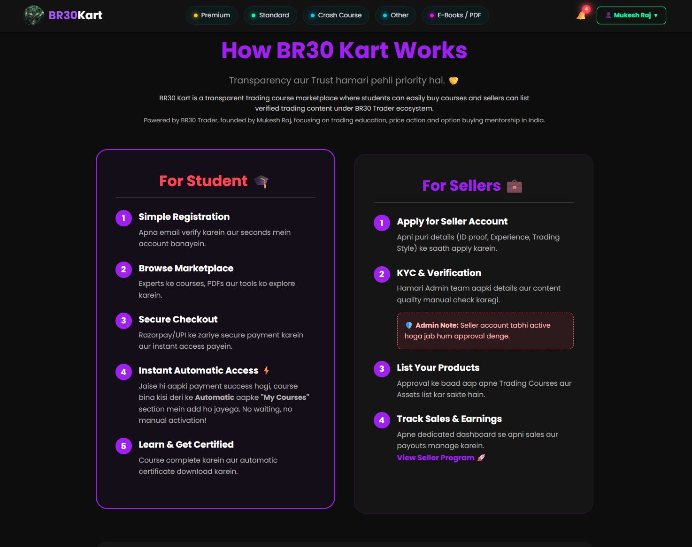

---

### ⭐ Premium Section

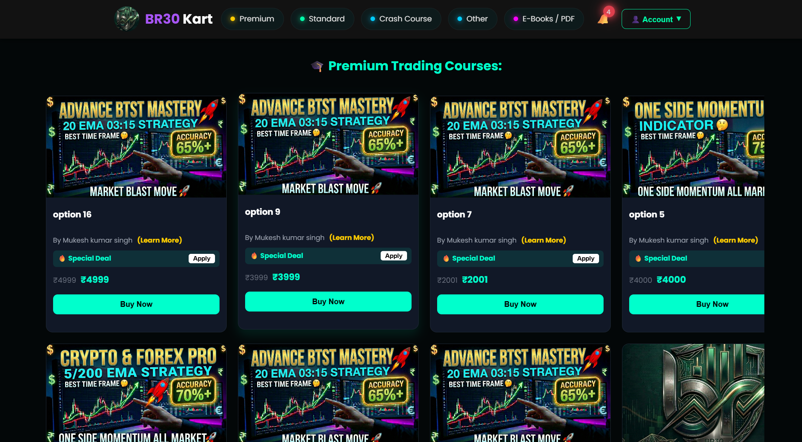

---

### 📚 Standard Course Section

---

### ⚡ Crash Course Section

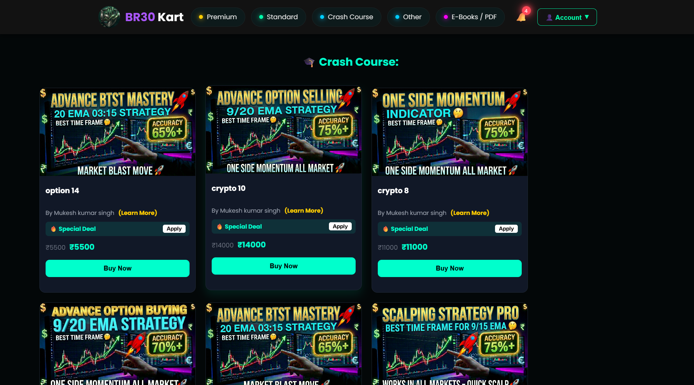

---

### 📘 PDF Section

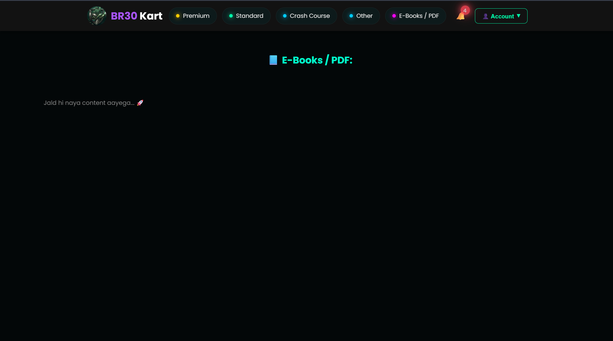

---

### 🧩 Other Section

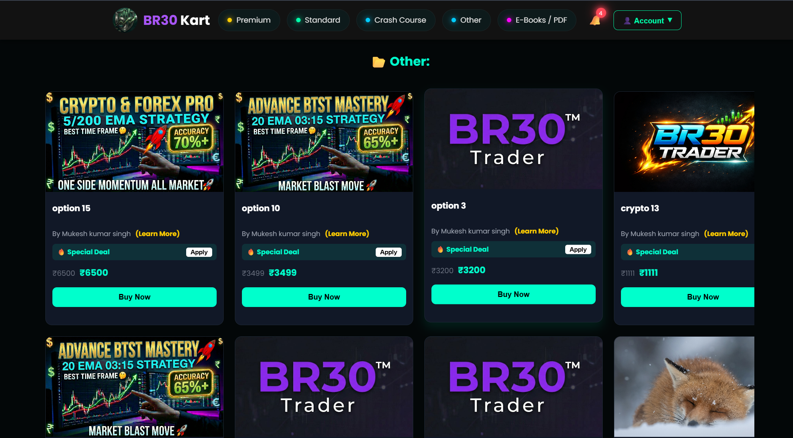

---

### 🔐 Login Page

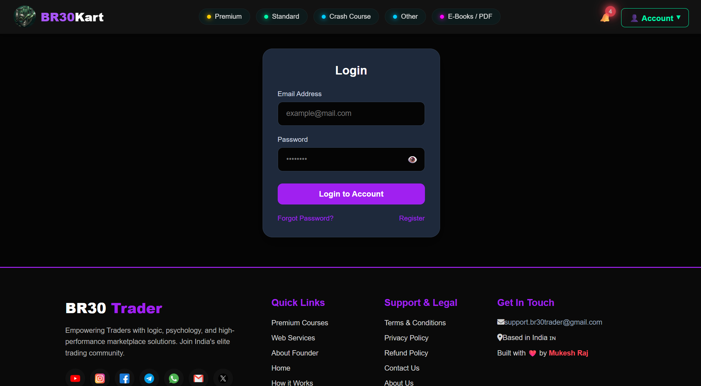

---

### 📝 Student Registration

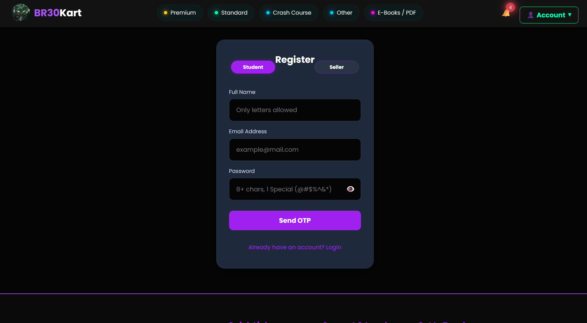

---

### 🛍️ My Course Page

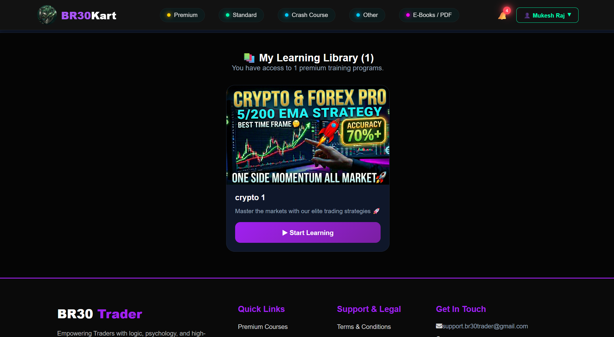

---

### ⭐ Review Section

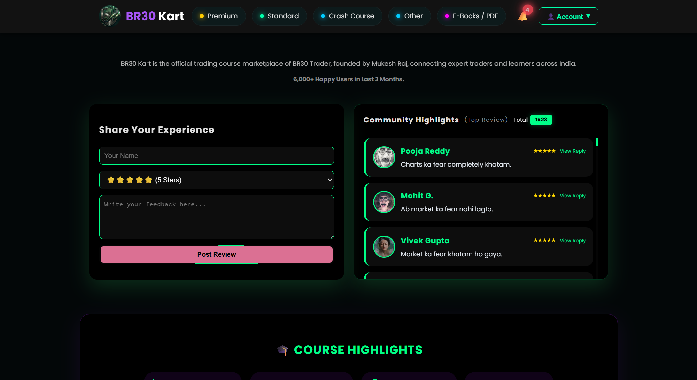

---

### 🎓 Certificate Page

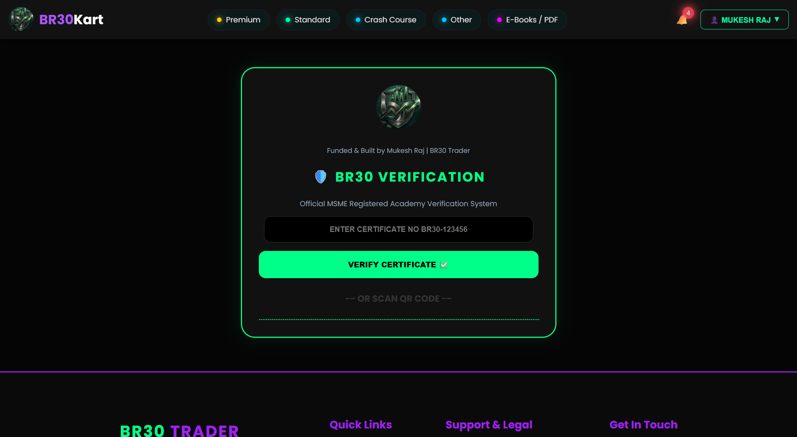

---

### 🔁 Reset Password Page

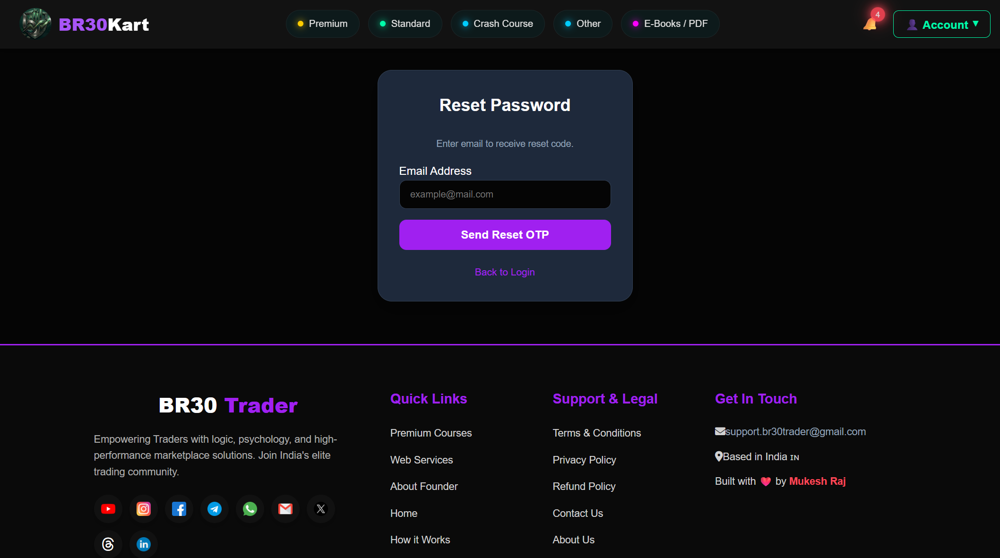

---

### 👨‍🏫 Seller Registration

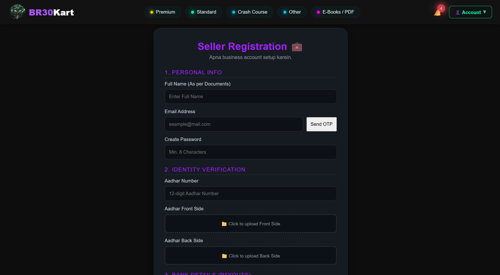

---

### 📊 Seller Dashboard

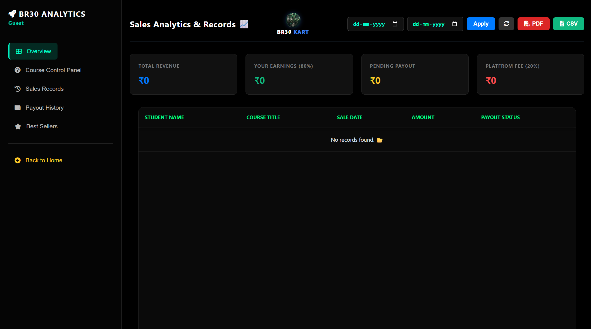

---

### ⚙️ Admin Dashboard

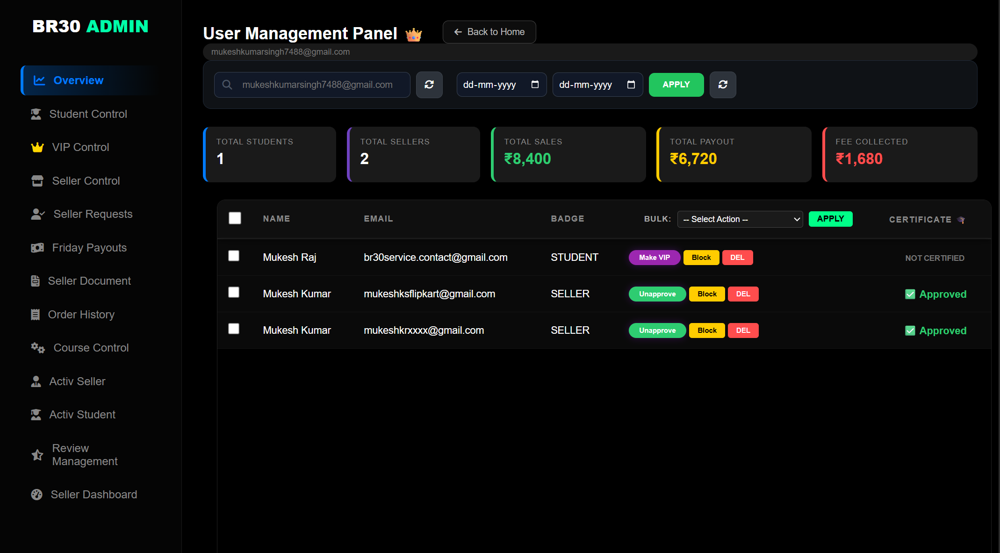

---

### 🔻 Footer Section

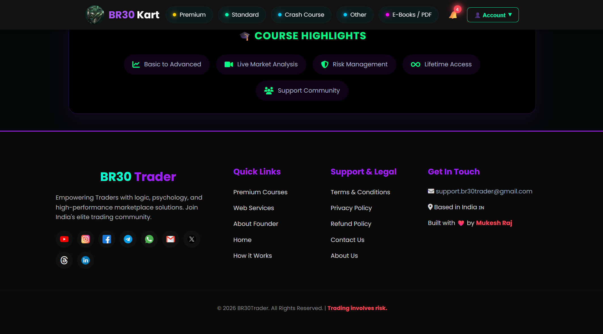

---

## 👨‍💻 Developed By

**Mukesh Raj**  
Founder — **BR30 Group**

---

## 📬 Connect With Me

### 🌐 Professional Network

 

### 📱 Social Media

    

### 💬 Community

 

### 📧 Contact

### 🚀 BR30 Ecosystem

---

## 🚀 Project Status

BR30 Kart is actively maintained and continuously improved with new marketplace features, seller tools, admin systems, digital product flows and platform enhancements.

---

### Build • Sell • Learn • Grow 🚀
